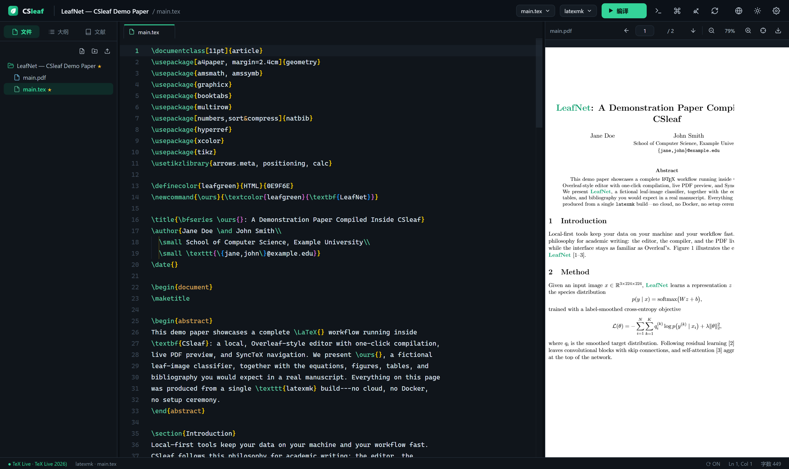

<div align="center">


# CSleaf

**本地优先的 Overleaf 风格 LaTeX 编辑器 · A local-first, Overleaf-style LaTeX editor**

[](LICENSE)
[](https://nodejs.org)
[](#-快速开始-quick-start)
[](#-贡献-contributing)

*无需 Docker · 无需联网 · 数据完全留在本机*
*No Docker · No cloud · Your papers never leave your machine*

[功能特性](#-功能特性-features) · [快速开始](#-快速开始-quick-start) · [模板](#-内置模板-templates) · [快捷键](#-快捷键-shortcuts) · [在线预览页](https://jensen-yao.github.io/CSleaf/)



</div>

---

## ✨ 为什么做 CSleaf？Why CSleaf?

写论文时你可能有这些困扰：

- **Overleaf** 好用但要联网、免费版编译有限制，私有化部署又要拖一整套 Docker；
- **TeXstudio / TeXmaker** 功能全，但界面停留在上个时代，PDF 预览体验割裂；
- **VS Code + LaTeX Workshop** 强大，但配置繁琐，不是为「打开就写」设计的。

**CSleaf 把 Overleaf 的体验搬回本地**：一条命令启动，浏览器里获得完整的三栏写作环境——左侧项目文件树、中间 Monaco 编辑器、右侧实时 PDF 预览。编译走你本机已有的 TeX Live / MiKTeX，所有数据都在你自己的磁盘上。

## 🌟 功能特性 Features

**项目管理**
- 🗂️ 项目画廊：创建 / 重命名 / 复制 / 删除 / 导出 ZIP / 从 ZIP 导入（支持 GitHub 下载的项目压缩包）
- 📚 8 个开箱即用的模板：中英文论文、IEEE 会议、Beamer、毕业论文、简历、数学笔记……全部经过真实编译验证

**编辑器（Monaco）**
- 📝 LaTeX 语法高亮、括号匹配、代码折叠（`\begin{}...\end{}` 区域）
- 🧠 智能补全：150+ 常用命令、环境代码片段，以及上下文感知补全
  - `\ref{` → 自动列出全文所有 `\label{}`
  - `\cite{` → 解析 `.bib` 文件，带标题预览
  - `\input{` / `\includegraphics{` → 列出项目内对应文件
- 📖 大纲导航：章节 / Beamer frame / 图表，点击跳转
- 🔍 快速打开（`Ctrl+P`）、命令面板（`Ctrl+Shift+P`）、多标签页、自动保存

**编译与预览**
- ⚡ 一键编译：支持 `latexmk`（自动多次运行 + BibTeX）/ `pdflatex` / `xelatex` / `lualatex`
- 🔁 保存后自动编译（可关闭），PDF 原位刷新不闪屏
- 🧭 **SyncTeX 正反向跳转**：`Alt+S` 从光标定位 PDF；双击 PDF 反向跳回源码
- 🐞 错误/警告面板：解析 `.log` 精确到文件与行号，点击即达；未安装宏包时给出提示
- 📄 PDF 预览：缩放、页码跳转、按宽度适配、下载

**界面与体验**
- 🌗 深色 / 浅色双主题，叶绿主色调，可拖拽调整三栏布局
- 🌏 中英双语界面，一键切换
- 📊 状态栏：TeX 发行版检测、中英文字数统计、光标位置、自动编译开关
- 🧹 一键清理辅助文件（`.aux/.log/.bbl/...`），文件树自动隐藏编译产物

## 🚀 快速开始 Quick Start

### 0. 前置条件：安装 TeX 发行版

CSleaf 只负责编辑和调用编译器，需要一个 TeX 发行版：

| 系统 | 推荐 | 安装方式 |
|---|---|---|
| Windows | **TeX Live**（全量）或 MiKTeX | [tug.org/texlive](https://tug.org/texlive/) · `install-tl-windows.exe` |
| macOS | MacTeX / TinyTeX | `brew install --cask mactex-no-gui` |
| Linux | TeX Live | `sudo apt install texlive-full` |

> CSleaf 会自动扫描 PATH 以及各盘符下的 TeX Live / MiKTeX / TinyTeX 安装（包括 `E:\texlive\2026` 这类非 C 盘安装），也可在 **设置** 中手动指定路径。

### 1. 启动 CSleaf

```bash
git clone https://github.com/Jensen-Yao/CSleaf.git
cd CSleaf
npm run setup     # 安装依赖 + 构建前端
npm start         # 启动 → 自动打开 http://127.0.0.1:4513
```

从模板新建项目，`Ctrl+Enter` 编译，开始写作 🎉

> 端口可用 `PORT=8080 npm start` 修改；论文数据保存在 `workspace/` 目录（已 gitignore，不会误提交）。

## 🎓 内置模板 Templates

| 模板 | 引擎 | 说明 |
|---|---|---|
| Blank | latexmk | 最小可编译文档 |
| 学术文章 Academic Article | latexmk | 章节 + TikZ 图 + 三线表 + 参考文献 |
| 中文学术论文 | xelatex | ctexart：摘要 / 关键词 / 图表 / 参考文献 |
| IEEE 会议论文 | latexmk | IEEEtran 双栏，含 figures & tables |
| Beamer 演示 | latexmk | 16:9 学术幻灯片 |
| 中文毕业论文 | xelatex | ctexbook：封面 / 摘要 / 目录 / 多章 / 附录 |
| 英文简历 Academic CV | latexmk | 单页学术简历 |
| 数学笔记 | latexmk | amsthm 定理环境 + 证明 |

## ⌨️ 快捷键 Shortcuts

| 快捷键 | 功能 |
|---|---|
| `Ctrl + Enter` | 编译 |
| `Ctrl + S` | 保存（默认已自动保存） |
| `Ctrl + P` | 快速打开文件 |
| `Ctrl + Shift + P` | 命令面板 |
| `Ctrl + B` / `Ctrl + Shift + E` / `Ctrl + J` | 切换 侧栏 / PDF 预览 / 日志面板 |
| `Alt + S` | SyncTeX：光标 → PDF |
| 双击 PDF | SyncTeX：PDF → 源码 |

## 🏗️ 架构 Architecture

```
┌────────────────────────── 浏览器 Browser ──────────────────────────┐
│  React 18 · Monaco Editor(LaTeX 语言) · PDF.js · Zustand · Vite    │
└──────────────────────────────┬─────────────────────────────────────┘
                    REST + WebSocket (127.0.0.1:4513)
┌──────────────────────────────┴─────────────────────────────────────┐
│  Node.js · Express · ws                                            │
│  项目/文件 CRUD · ZIP 导入导出 · 编译编排(latexmk/xelatex+重跑+BibTeX)│
│  日志解析(错误定位/警告/缺失宏包) · SyncTeX CLI 封装 · TeX 自动探测  │
└──────────────────────────────┬─────────────────────────────────────┘
                        本机 TeX 发行版（TeX Live / MiKTeX / TinyTeX）
```

- 仅 4 个后端运行时依赖（express / ws / multer / adm-zip），前端 Monaco 与 PDF.js 全部本地打包，**内网离线可用**
- 默认只绑定 `127.0.0.1`

## 🗺️ Roadmap

- [ ] Git 集成（项目级版本历史）
- [ ] 拼写检查与语法提示（ChkTeX / LanguageTool）
- [ ] 富文本公式/表格插入向导
- [ ] 多项目全文搜索
- [ ] 桌面壳（Electron/Tauri）与安装包
- [ ] 中文参考文献样式（GB/T 7714）模板

## 🤝 贡献 Contributing

欢迎 Issue 与 PR！开发模式：

```bash
npm install && npm install --prefix web
npm run dev:web   # 前端热更新 (Vite, 端口 5188, 代理 /api → 4513)
npm start         # 后端
```

## 📄 许可 License

[MIT](LICENSE) © 2026 Jensen-Yao

## 🙏 致谢 Acknowledgements

灵感与依赖来自这些优秀的开源项目：[Overleaf](https://github.com/overleaf/overleaf)（产品形态）、[LaTeX Workshop](https://github.com/James-Yu/LaTeX-Workshop)（编译/解析思路）、[Monaco Editor](https://github.com/microsoft/monaco-editor)、[PDF.js](https://github.com/mozilla/pdf.js)、[TinyTeX](https://github.com/rstudio/tinytex)。

<div align="center">
<i>如果 CSleaf 对你有帮助，欢迎点一个 ⭐</i>
</div>
